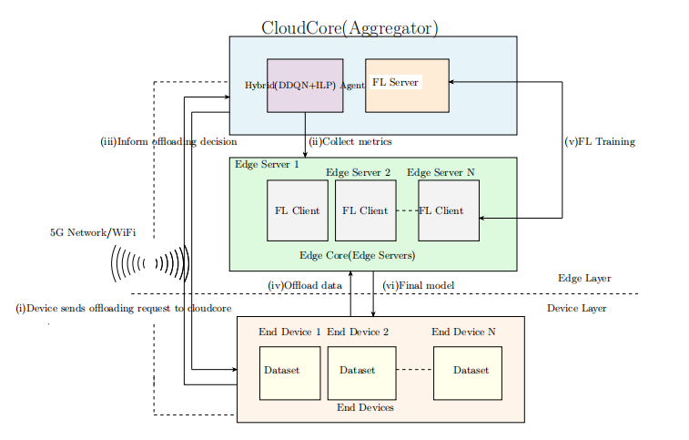

# Hybrid DDQN-ILP Framework for Intelligent Offloading with Federated Learning

**Achievement: 20-30% latency reduction | 28.6% cost improvement | 85% model accuracy**

Deployed on physical testbed: 20 VMs (19 edge + 1 cloud) | 5G/WiFi network

A hybrid Deep Double Q-Network (DDQN) and Integer Linear Programming (ILP) framework for adaptive, constraint-aware task offloading in Federated Learning environments.

---

## Overview

Modern edge computing environments host latency-sensitive applications such as autonomous driving, augmented reality, and industrial IoT simulations. These applications generate computational tasks that must be offloaded swiftly from resource-limited devices to more powerful edge nodes.

This project proposes a hybrid DDQN + ILP offloading agent that combines the adaptive learning capability of reinforcement learning with the optimization precision of mathematical programming. The system is validated on a physical testbed of 20 heterogeneous virtual machines and integrated with a Federated Learning pipeline using FedProx aggregation.

---

## System Architecture



---

## How It Works

### Offloading Pipeline

1. Laptops send offloading requests to the Cloud Controller VM.
2. Cloud VM collects real-time metrics (CPU, memory, bandwidth) from all 19 edge VMs.
3. DDQN Phase: Computes Q-values for each edge node and selects the top-k candidates.
4. ILP Phase: Applies hard resource constraints and selects the single optimal edge VM.
5. Laptop offloads its data or task to the selected edge VM.
6. FL training runs locally on the edge VM using the offloaded data.
7. Model updates are sent back to the FL server for aggregation.

### Federated Learning

- Each edge VM trains a local CNN model on its private dataset (Fashion-MNIST).
- Only model parameters, not raw data, are transmitted to the FL server.
- FedProx aggregation handles non-IID data distributions across clients.

---

## Algorithms

### Algorithm 1 — Hybrid Offloading (DDQN + ILP)

```
Input:  Edge nodes E = {e1, ..., e19}, Current metrics Mt
Output: Selected edge node e_selected

1. Collect system state St from all edge nodes
2. [DDQN] Compute Q-values: Q(St, ei) = DDQN_forward(St, ei)
3. [DDQN] Select top-k candidates: C = topk(Q)
4. [ILP]  Minimize: sum of (w1 * latency_i + w2 * energy_i) for ei in C
          Subject to: CPU_i <= CPU_max, MEM_i <= MEM_max
5. Solve ILP and return e_selected
```

### Algorithm 2 — Federated Learning (FedProx)

```
Input:  Global model Wt, Edge clients C, Local datasets Di
Output: Updated global model Wt+1

For each edge client ci in C:
  1. Download global model Wt
  2. Train locally: Wi_t+1 = Train(Wt, Di)
  3. Compute update: delta_Wi = Wi_t+1 - Wt

Aggregate: Wt+1 = Wt + (1 / |C|) * sum(delta_Wi)
Return Wt+1
```

---

## Experimental Setup

### Hardware Configuration

| Component        | Role                     | RAM    | Cores    |
|------------------|--------------------------|--------|----------|
| Cloud Core       | Central Controller       | 16 GB  | 12       |
| Edge Servers     | High-Capacity VMs        | 8-9 GB | 8        |
| Edge Servers     | Mid-Tier VMs             | 7 GB   | 8        |
| Edge Servers     | Resource-Constrained VMs | 4-6 GB | 4        |
| End Devices      | Laptops                  | 8 GB   | Standard |

Total: 20 VMs (19 edge servers + 1 cloud controller), connected over 5G/WiFi.

### Software Stack

| Component      | Technology       |
|----------------|------------------|
| Language       | Python 3.8       |
| DRL Framework  | Custom DDQN      |
| Optimization   | ILP Solver       |
| FL Aggregation | FedProx          |
| Local Model    | CNN (TensorFlow) |
| Dataset        | Fashion-MNIST    |

---

## Results

### Latency

| Phase                             | Average Latency | Range          |
|-----------------------------------|-----------------|----------------|
| Warm-up (ILP only, rounds 1-5)    | 33.4 ms         | 28.4 - 42.3 ms |
| Post-DDQN integration (rounds 6+) | 10.8 ms         | 8 - 15 ms      |

Approximately 20% latency reduction after DDQN integration.

### Model Accuracy

| Round     | Global Accuracy |
|-----------|-----------------|
| Round 1   | ~40%            |
| Round 17  | ~80%            |
| Round 20+ | ~85% (stable)   |

### Cost Optimization

| Method                | Convergence Round | Final Cost |
|-----------------------|-------------------|------------|
| Pure DDQN (baseline)  | ~35               | ~0.0042    |
| DDQN + ILP (proposed) | 26                | 0.003      |

28.6% cost improvement over pure DDQN.

### Summary

- 20-30% latency reduction compared to baseline methods
- 28.6% cost improvement over pure DDQN
- 85% FL model accuracy under non-IID conditions
- Balanced load distribution with variance under 15% across all 19 nodes
- CPU and memory constraints always satisfied via ILP

---

## Comparison with Related Work

| Aspect       | Li et al.      | Proposed Work     |
|--------------|----------------|-------------------|
| Core Method  | Pure DDQN + FL | DDQN + ILP + FL   |
| Optimization | RL only        | RL + Mathematical |
| Constraints  | Reward-based   | Explicit ILP      |
| Environment  | Simulation     | Physical testbed  |
| Resources    | Homogeneous    | Heterogeneous VMs |

---

## Limitations

- The current evaluation is limited to 20 VMs. Larger-scale validation is needed.
- The hybrid DDQN + ILP approach introduces additional computational overhead compared to simpler methods.
- The framework's ability to handle rapid or unpredictable edge node failures requires further investigation.

---

## Future Work

- Scalability Analysis: Evaluate performance under larger numbers of edge nodes and end devices.
- Mobility-Aware Scheduling: Incorporate real-world vehicular and urban mobility patterns into scheduling decisions.
- Secure Aggregation: Build defenses against adversarial attacks targeting the federated learning pipeline.

---
